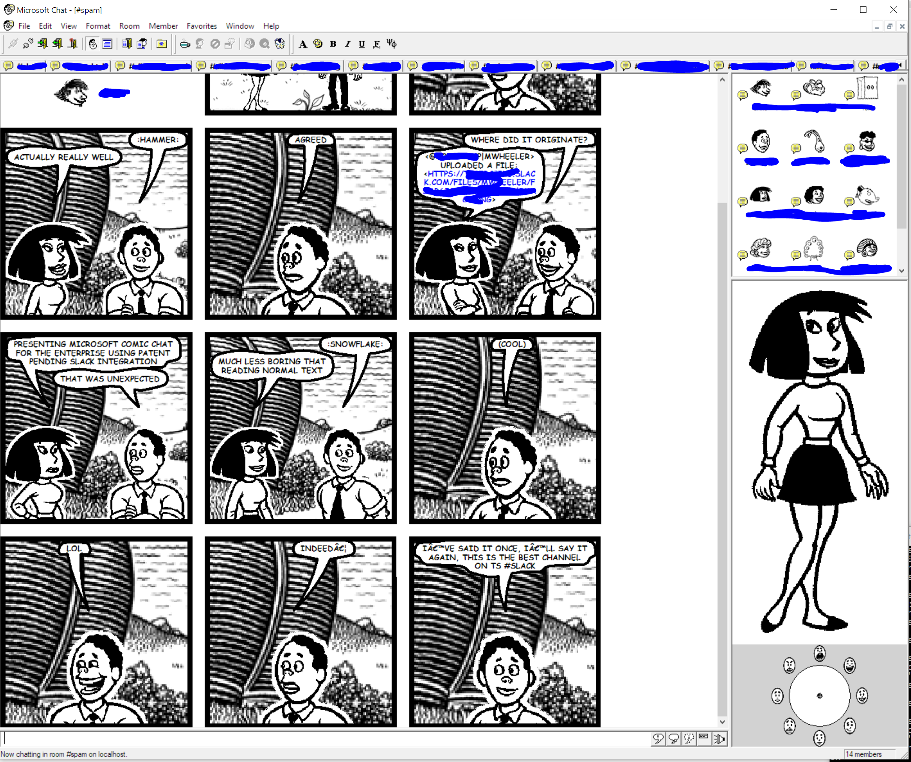

Comic Slack
==

Really basic (concept) Slack RTM API to IRC like server to connect to MS Comic Slack

Currently Supports
--

- Connecting
- Sending and recv messages

TODO
--
- Provide this as a service
- Map reactions between slack and comic chat (can probably only do this one way)
- Send data about the scene
- Joining and parting channels through comic chat
- Forward presence status
- Leave and join messages
- Private messages
- Replace out (really) hacky code

Why
--
- Comic Chat - why not
- Why not just use the Slack IRC gateway - comic chat doesn't support SSL and most Slacks don't have IRC turned on

Strech goal
--
- Netmeeting gateway...

Installing
--

1. Install Comic Chat - http://www.mermeliz.com/download/cchat/mschat25.exe
1. `git clone thisrepo`
1. `npm install`
1. `set SLACK_BOT_TOKEN=YOURSLACKTOKENHERE` (you can get the token from looking in the network tab of chrome when connecting to slack - it's the query string in the web socket connection)
1. `node index.js`
1. Wait for it to connect to Slack
1. Open Ms Comic Chat, set your nick to your slack nick and connect to localhost (select Just connect to server)

Development
--
Don't bother - this code is a terrible. Srsly

I've rolled my own IRC server to make MS Comic Chat happy. I think this could be useful to mess around with how comic chat displays things 